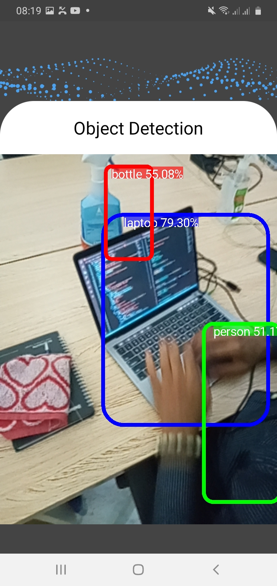
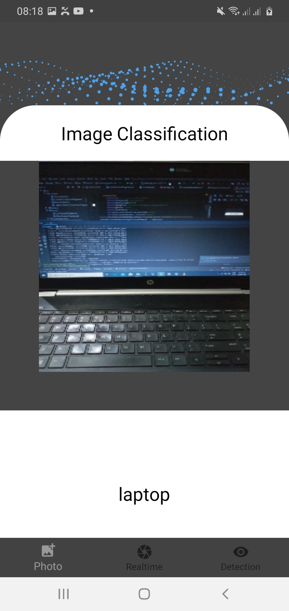
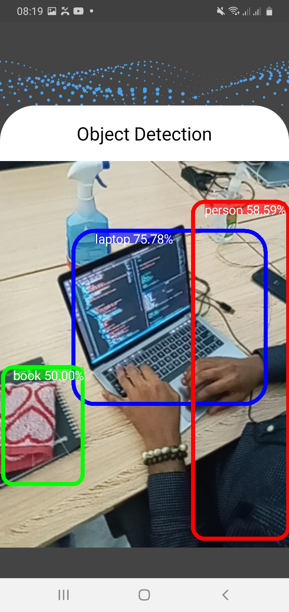
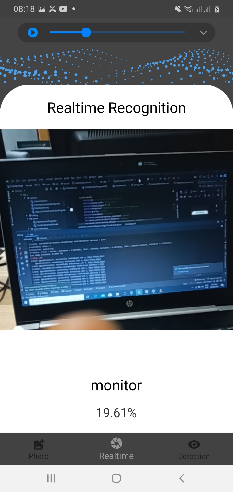
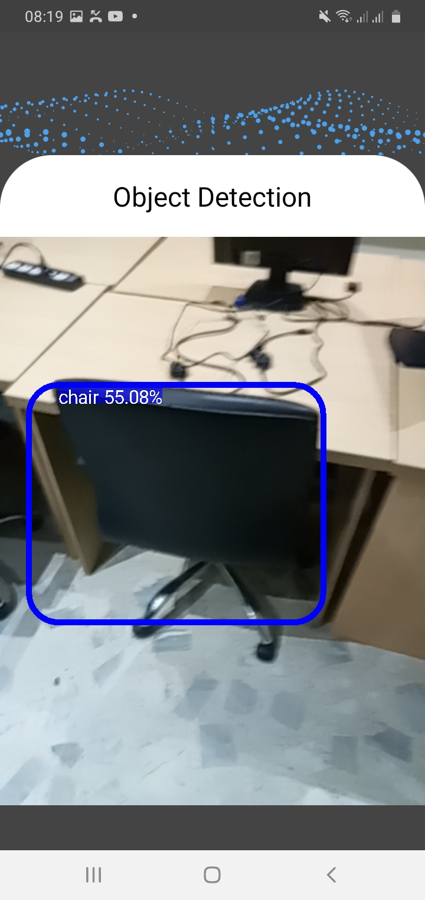
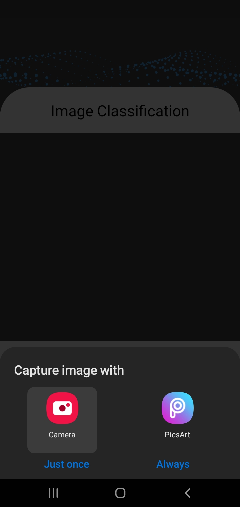

# SeeingThings
This is an android app that performs image classification, image recognition and object detection

## Project Overview
This is to demonstrate how to use deep learning model on edge devices for real time application. 
Many applications with the cloud get data locally, send the data to the cloud, process it, and send the result back.
The edge means there’s no need to send to the cloud; 
it can often be more secure (depending on edge device security) and have less impact on a network
The edge means there’s no need to send to the cloud.
However, to deploy model on mobile application with limited computing resources and storage limitation can be 
a real challenge,hence, most application perform inference in the cloud and send back result to the device via api call.
But, this could also be a challenge in some part of the world with low bandwidth and poor internet connection, 
or in application of low latency or network is unavailable that beg the request the need to run model on the edge.

Model can be optimized to run on edge by freezing, qunatization and fusion. 
This application uses a model quantized by converting to tensorflowlite to make prediction.
It performs image classification, object detection and image recognition. 

## Tools 

-Tensorflow
-Android Studio

## Screenshot

